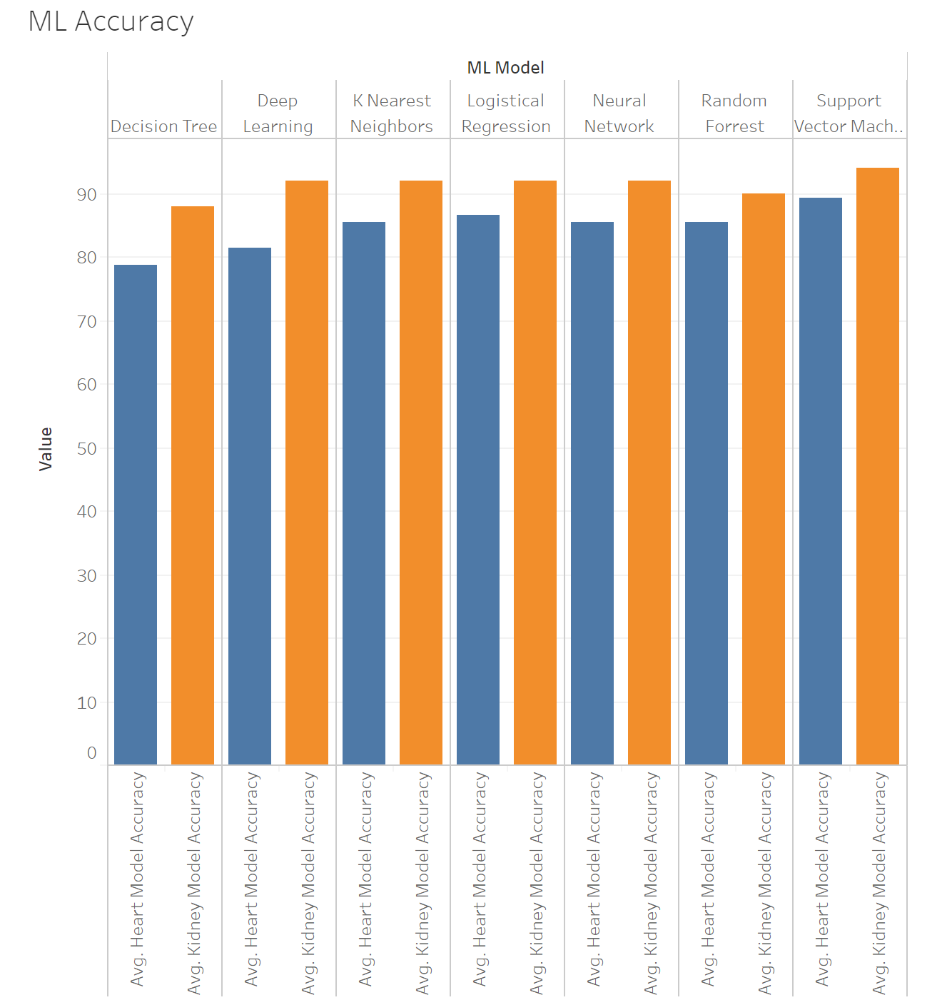

# Health Prediction

## Overview: 
### According to the Centers for Disease Control and Prevention, as of 2018 there were 6.2 million adults in the United States living with heart failure. Fatality from this condition in the same year was 13.4 percent. Armed with this information, our mission was to be able to predict fatal heart failure. Through our research we discovered correlation between kidney disease and heart failure. The following project is an analysis that utilized machine learning to predict and diagnose key factors of fatal heart failure and chronic kidney disease. For full project and data sources please follow the link below. 

## Published Website: https://trevorguleserian.github.io/Health-Prediction/templates/index.html
### Tableau Analysis: https://public.tableau.com/views/HeartKidneyFailureAnalysis_16011451182000/Story1?:language=en&:embed=y&:embed_code_version=3&:loadOrderID=0&:display_count=y&publish=yes&:origin=viz_share_link

## Heart Failure Analysis
### According to the Centers for Disease Control and Prevention, as of 2018 there were 6.2 million adults in the United States living with heart failure. Fatality from this condition in the same year was 13.4 percent. Armed with this information, our mission was to be able to predict fatal heart failure based on 12 unique factors. These factors include age, anemia, creatinine phosphokinase, diabetic, ejection fraction, high blood pressure, platelets, serum creatinine, serum sodium, sex, smoking, and time between follow up appointments. This real-life data was acquired through Kaggle (Link above). In our analysis we utilized seven machine learning models to gain better insight into the best factors of indication and categorical predictions. The machine models utilized were decision tree, random forest, logistical regression, support vector machine, K nearest neighbors, neural networks, and deep learning. The model with the best accuracy rate was Support Vector Machine with an accuracy rate of almost 90 percent. The best indicators of fatal heart failure were the time between follow up appointments (36%), serum creatinine (16%) levels, and ejection fraction (12%). Finally, below you will see the predictive confusion matrices for the normalized and non-normalized outcomes for the decision tree, random forest, logistic regression, and support vector machine models.

## Kidney Failure Analysis
### When predicting heart failure, one factor to consider is Coronary Artery Disease. There is a positive correlation between coronary artery disease and kidney failure, so we decided to explore further if the factors that predict kidney failure can also be used in predicting coronary artery disease. Using the Kaggle dataset in the link above, we looked at 25 measures of data including 1 class, 11 numeric, and 14 nominal data types for 154 instances. We were able to predict with 97.44% accuracy whether or not a patient has coronary artery disease.

### Prior to analysis, the data was cleaned by removing rows with absent and erroneous information, reducing the instances from 400 to 154. Categorical data was binary encoded and then data was split into training and testing data groups. The prediction models tested include decision tree, random forest, logistical regression, support vector machine, K nearest neighbors, neural networks, and deep learning. These models yielded predictions with 89.74% – 97.44% accuracy but low precision for predicting positive results for Coronary Artery Disease. The most accurate models for predicting coronary artery disease were the random forest decision tree and K nearest neighbors which both predicted outcomes with 97.44% accuracy. However, the Logistic Regression Model, while less accurate at 92.31%, provided higher precision in predicting true positive results. Additionally, using the random forest decision tree model, the most significant factors for predicting coronary disease were serum creatinine, blood glucose random, blood urea, and sugar.

### Machine Learning Accuracy:

